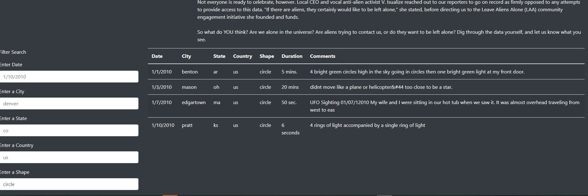

# UFOs

## Overview
This was to get myself familiar with javascript and html to display dynamic tables with filter a set of data.
The data used was for UFO sightings from aournd the world and needed a way to filter them based on when, where, and what shape they were in.

You can test the site at the link [here](https://mattdharmon.github.io/UFOs/).

## Results
Enter in a search criterea and hit enter to narrow down your search results.

For example, figure out where people see circle shapped UFOs.

## Summary
The drawback of this website as of right now is that the data isn't live from a database, but a local data file. If there are any new sightings, the data will not update automaticlly.

One improvement would be able to download the filterd data in a nice csv file for the user to analyze the data further using excel or R programming language.

It would also be nice to apply this data to some form of map using google maps, etc. to view the sighting hotspots.
